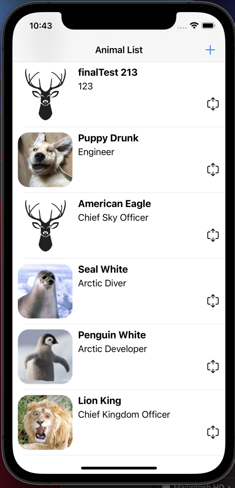
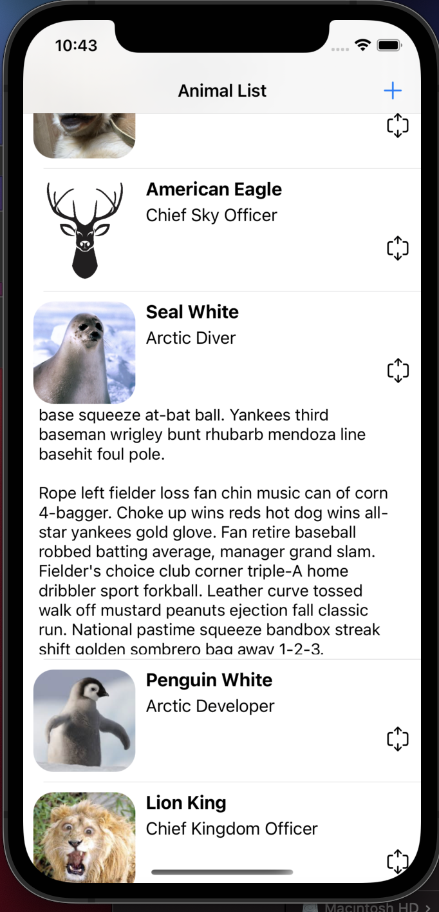
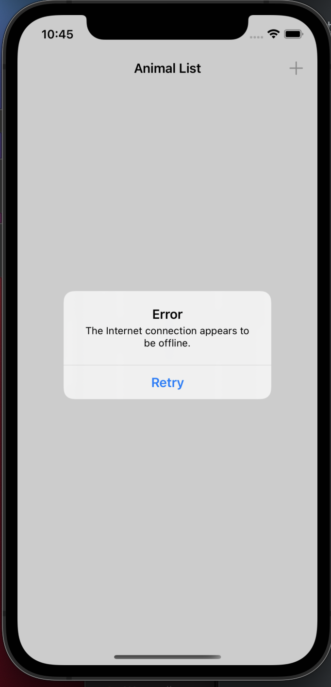

The task is to create the "Animal Kingdom" app using the attached animal.json file. How you accomplish this task and how you want the information to be displayed, is up to you. Feel free to use any 3rd party libraries or tools to help you accomplish the task.

*Backend:*

https://github.com/art22m/demo

I wrote a simple Java backend using the Spring framework. I have implemented simple GET and POST requests to get a list of animals and upload them. The database has not been used. Backed is hosted on heroku service. I hope that when you check this task, the service is working =)

*Mobile app*:

I have implemented a mobile app in Swift language using UIKit programmatically only. No additional libraries were used. When launching the mobile application, we see a list of animals (GET request). By clicking on a table cell, we can see the description of the animal. Errors are handled by showing the alerts (e.g. network connection failed). We can also manually add an animal to the list (POST request).

